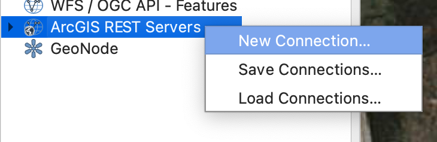
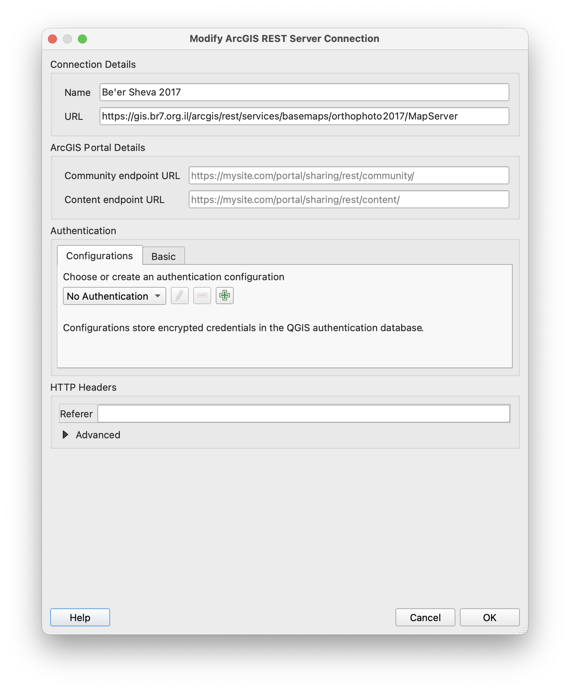

# Using Aerial Photography with QGIS

QGIS is a free and open-source cross-platform desktop geographic information system application that supports viewing, editing, printing, and analysis of geospatial data. All information and images viewed and used within QGIS is georeferenced,

{: .highlight }
Install QGIS from [https://www.qgis.org/].

### Adding Layers from Public Repository

We'll add some content available on the Be'er Sheva municipal GIS website. We'll start with the short version, and then I'll go into more details that might help you in the future.

- After creating a new project, look at the _Browser_ panel on the left side of the screen.
- Right-click _ArcGIS REST_ Servers* and choose \_New Connection*.

  

- Add the following details:
  - **Name**: Be'er Sheva 2017
  - **URL**: https://gis.br7.org.il/arcgis/rest/services/basemaps/orthophoto2017/MapServer
    
- Double-click on the new connection you created, _Be'er Sheva 2017_.
- Double-click any of the layers available under that connection. That layer will be added to your project.

After completing these stems, you should have unlimited access to the 2017 high-definition orthophoto map of Be'er Sheva. You can export images and maps of any size with QGIS without the need to capture your screen.

Theoretically, this can be achieved with any municipality which offers an online GIS browser. I'll demonstrate how I got the URL for the Be'er Sheva orthophoto layer.

### Hacking a Municipal GIS Website

Navigate a GIS website of your choice. For this example, I will use the [Be'er Sheva one].

Right-click anywhere on the website and choose _Inspect_ (alternatively, press **Cmd + Option + I** on a mac, or **Ctrl + Shift + I** on Windows).

On the new panel at the left side of your screen, look for the _Network_ tab, and keep it open. It will show you all the elements that are being loaded on the website.

On the GIS website, load the layer you are interested in, for example - the _2020 Orthophoto_. As you load that layer, you will notice a lot of movement on the Network panel, as new pieces of the orthophoto are loaded up. Click any of the items in the Network panel, and a small image tile will open on your browser in a new tab.

In the new tab with the image tile, look at the URL - it is very similar to the URL we've used to load the 2017 orthophoto. You can use that URL to load the 2020 orthophoto to QGIS, just remove the last bit of the URL that looks something like this: **tile/2/3019/2575**.

{: .highlight }
https://gis.br7.org.il/arcgis/rest/services/basemaps/OrthoPhoto_2020/MapServer/~~tile/2/3019/2575~~

[https://www.qgis.org/]: https://www.qgis.org/
[be'er sheva one]: https://gis.br7.org.il/apps/br7/
