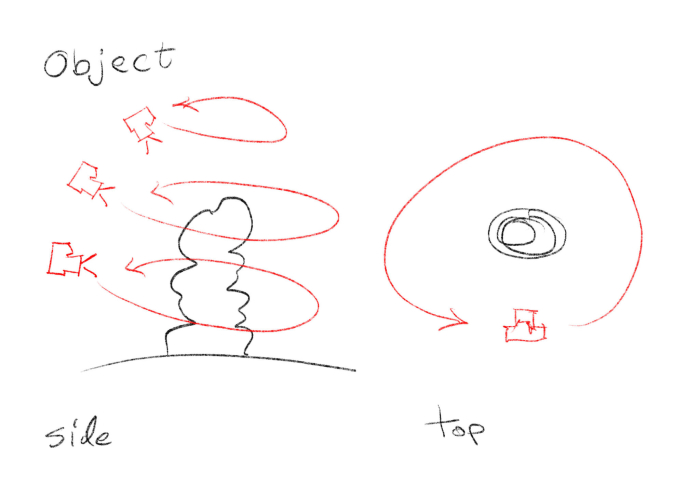

# Workshop: Photogrammetry

When taking pictures for a photogrammetry model, it is always better to capture with a professional camera (the bigger the better), using RAW format, and to post-process the images on your computer. If you don’t know what RAW format is, then just capture with whatever you’re used to.

## Capturing an Object

Circulate around the object, taking pictures from multiple sides. You should capture from various heights, creating a sort of “dome” on top and around the object. Each picture should capture the entire object, but you could also take additional close-up pictures to get better details.

## Capturing a Facade

For a facade, you want to have a few images of each detail from several positions. To that end, you can simply walk along the facade, and capture images in 3 directions. Make sure you have a lot of overlap between the images.

## Capturing an Interior

Go around the room, with your back to the wall, and capture images of the walls that are opposite from you. You may want to take the images in portrait orientation so that a single image would capture from the ceiling to the floor. You may need to take a few images of the middle of the floor and ceiling from time to time, to make sure they are covered in your images.

## Interior – Multiple Rooms

If you want your model to connect several rooms, you need to have a buffer between them that is sufficiently covered by images, so that the computer knows how to connect them. If there’s no opening between the two rooms, there’s no way to connect them automatically.

Capture the two rooms as any other single interior room. Then capture the doorway or opening between them, as if it was an object – meaning, from many different sides.

## Processing

There’s a few photogrammetry software available with different pros and cons:

- RealityCapture – the best available software. Available only for Windows PC, with Nvidia graphic cards. Costs some money, per usage (you pay for how many images you used).
- Meshroom – free and open source. Available only for Windows PC, with Nvidia graphic cards.
  Metashape – available for both Windows and Mac. You’ll need to buy a copy, but a discounted educational version is available.
- 3DF Zephyr Free – another free version, only available for Windows. Haven’t used it so can’t give my input on it.
- Polycam – online cloud processing tool. Usable as both a smartphone app (for grabbing pictures with the app), and a browser-based app (for importing pictures taken earlier). Subsctiption based, 150 models per month.
