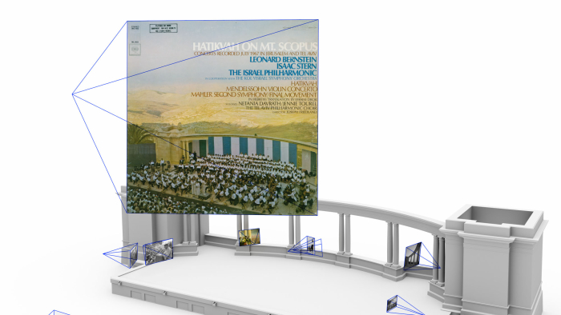

# Introduction

A single photograph contains more than just documentation of its subject. When studied closely, photographs provide much more information about the context of the photographic moment, and on the intentions and subjectivity of the photographer. Computational photography – the processing of photographs as digital information – allows us to step outside of the photographic moment and context, t eliminate subjectivity (or at least try to), and to study photographs as architectural documents and as forensic evidence.

In this 3-day workshop, students will experiment with computational and photographic techniques to study and represent sites and places. Working in groups, students will work on a specific site and examine it using GIS mapping software, photogrammetry, programming, drone photography, archival and municipal information, 3d photographic reconstruction, and machine learning.

Out of the many tools you will be introduced to during this workshop, each student will pick one or two to further develop and experiment with. The purpose of this workshop is to encourage you to explore new forms and mediums for the production of spatial knowledge.